# SQL-SERIES
# INTRODUCTION
SQL (STRUCTURED QUERY LANGUAGUE) is a programming language designed for managing and querying relational databases. It provides a standardized way to interact with databases

## CREATING A DATA BASE AND  TABLE 

CREATE DATABASE VictorEduCenter

USE VictorEduCenter

CREATE TABLE Student_Information(

Name_of_student  varchar(100),

StudentID_Number   int,

Age                int,

phone              bigint,

Email              varchar(150),

Gender             char(10),

Address            varchar(200),

State_of_Origin    varchar(50),

Date_of_Birth      date

)

### Screenshoot of the SQL Syntax for creating Table
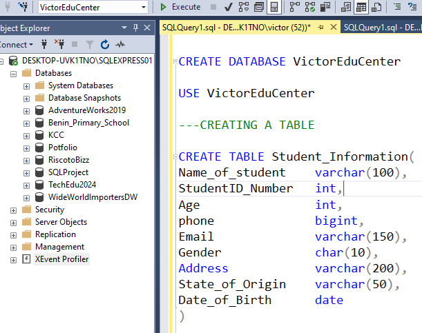

## POPULATING THE TABLE

INSERT INTO [dbo].[Student_Information]
VALUES(

'Monday Abanobi', 1001, 26, 08123456789,'mondayabanobi@gmail.com', 'Male',
'NO 10 Modigbo Street Abuja', 'Abia State', '1998-01-11',

'Olaruwaju Ajayi Christ', 1002, 30, 8109876543 ,'olaruwajuchrist@gmail.com', 'Male',
'NO 99 Luka Street  Abuja', 'Oyo State', '1994-01-11',

'Annabella Osazuwa Grace', 1003, 28, 7089235670,'annabellaoboh@gmail.com', 'Female',
'NO 50 Mutala Muhammed Street  Abuja', 'Edo State', '1996-07-20',

'Oyiwoza Paul Dorcas', 1004, 31, 9029384750,'oyiwozapaul@gmail.com', 'Female',
'NO 12 Lagos Street  Benin City', 'Benue State', '1993-07-20',

'Peter Ajanaku Cyril', 1005, 33, 9181209348,'peterajanaku@gmail.com', 'Male',
'NO 112 Mater Dei Street  Owerri', 'Imo State', '1991-12-02',

'Yahaya Mutari Nasri', 10010, 25, 09090341278,'yahayanasri@gmail.com', 'Female',
'NO 10 Dantata Street Jigawa', 'Jigawa State', '5-9-1999'

)

### Screenshoot SQL Syntax for Populating the table
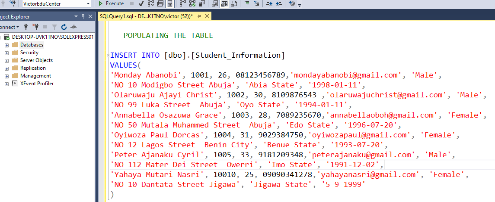

### View of the Table information

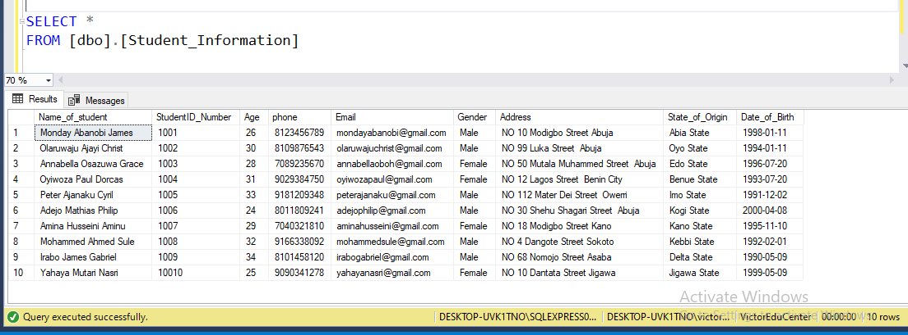

## ADDING NEW COLUMN TO THE TABLE

ALTER TABLE [dbo].[Student_Information]

ADD Courses varchar(50)

### View of the new column added to the table

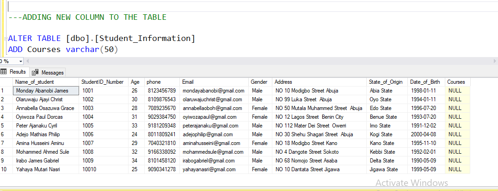

## UPDATING THE NEW COLUMN (COURSES) WITH INFORMATION

UPDATE [dbo].[Student_Information]

SET Courses

= CASE 

WHEN StudentID_Number = '1001'THEN 'Data Analysis'

WHEN StudentID_Number = '1002'THEN 'UI/UX'

WHEN StudentID_Number = '1003'THEN 'Data Science'

WHEN StudentID_Number = '1004'THEN 'Virtual Assistant'

WHEN StudentID_Number = '1005'THEN 'Backend Engineer'

WHEN StudentID_Number = '1006'THEN 'Business Analytics'

WHEN StudentID_Number = '1007'THEN 'Frontend Engineer'

WHEN StudentID_Number = '1008'THEN 'Full Stack'

WHEN StudentID_Number = '10010'THEN 'Customer Success Manager'

END

### view of the new column updated
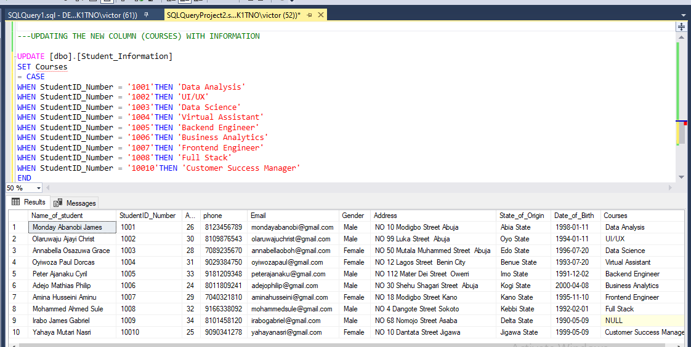

## UPDATING THE COURSE COLUMN THAT IS SHOWING NULL

UPDATE [dbo].[Student_Information]

SET [dbo].[Student_Information].Courses = 'Database Administrator'

WHERE [dbo].[Student_Information].State_of_Origin = 'Delta State'

### view of the updated column showing Null
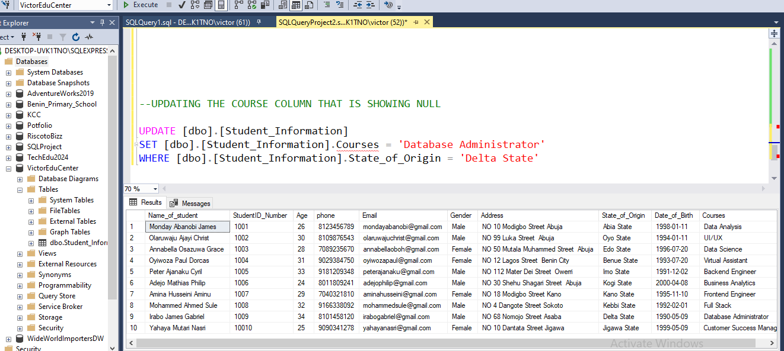

## ANOTHER COLUMN ADDEED CALL LOCATION

ALTER TABLE [dbo].[Student_Information]

ADD Location varchar(100)

### view of another column added
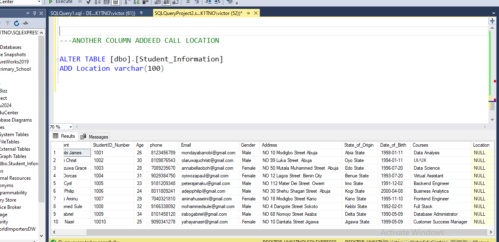

## DELETING THE COLUMN (LOCATION) BECAUSE IT IS NOT NEEDED

ALTER TABLE [dbo].[Student_Information]

DROP COLUMN Location

### view of the column deleted

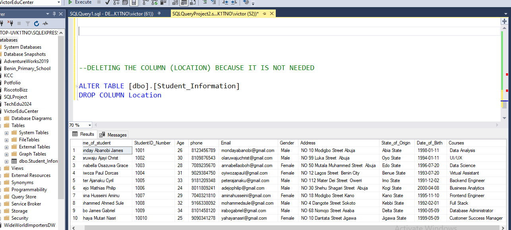

## SELECT Statement:

The SELECT statement retrieves data from one or more tables. You can select specific columns or use * to select all columns.

SELECT *

FROM [Dimension].[City]

SELECT [City Key],[State Province],City,Continent

FROM [Dimension].[City]

### view of select statement

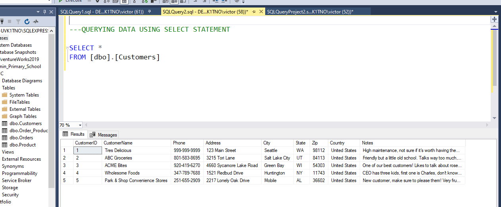

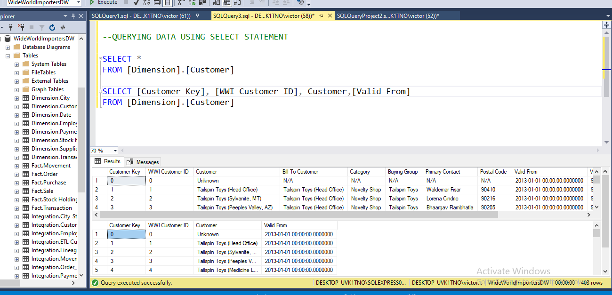

## USING ORDERBY TO SORT RECORDS ASCENDING OR DESCENDING

SELECT [City Key],[Order Date Key], Quantity, [Unit Price], [Tax Amount]

FROM [Fact].[Order]

ORDER BY [Tax Amount]

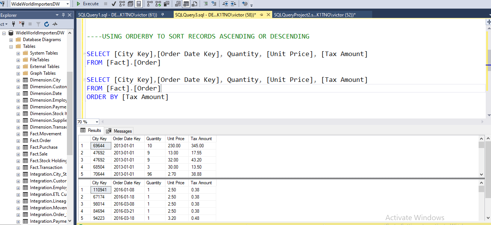

## Using the where clause to filter data 

SELECT *

FROM [Fact].[Order

SELECT [city key],[Order Date Key] Quantity, [Unit Price], [Tax Amount]

FROM [Fact].[Order]

WHERE [Unit Price] < 10

## Questions; using fact order table, returns items that were order only on the 31/5/2016

SELECT *

FROM [Fact].[Order]

WHERE [Order Date Key]= '5/31/2016'

## Questions; using fact order table, returns items only that were not order on the 1/1/2013
	
SELECT [Order Key], [Customer Key], [Order Date Key], Description

FROM [Fact].[Order]

WHERE [Order Date Key] <> '1/1/2013'

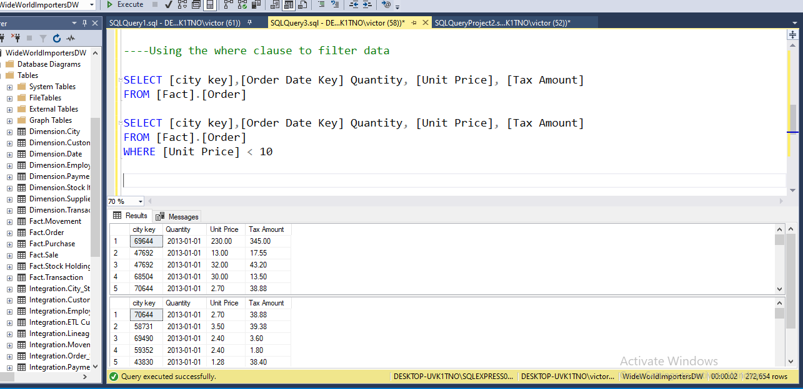

## ARITHMETIC OPERATIONS 

SELECT SUM ([Tax Amount]) AS TOTAL_TAX

FROM [Fact].[Order]

SELECT AVG([Tax Amount]) AS AVERAGE_TAX

FROM [Fact].[Order]

SELECT  Count (*)

FROM Fact.Sale

## Questions; Use Fact. Order Table to get Revenue for the order.

SELECT [WWI Backorder ID], Description, Quantity,

[Unit Price],([Quantity] * [unit price])AS Revenue

FROM [Fact].[Order]

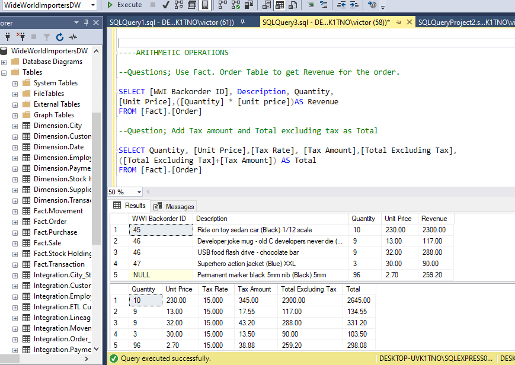

## Question involving And Operators

### Fetch all records from fact.order table where salesperson key 19 and WWI order ID is 4

SELECT *

FROM [Fact].[Order]

WHERE [Salesperson Key] = 19

AND [WWI Order ID] = 4

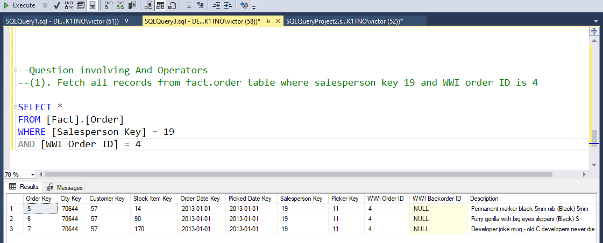

## JOIN

A join clause in the Structured Query Language (SQL) combines columns from one or more tables into a new table. 

The SQL JOIN is a command clause that combines records from two or more tables in a database. It is a means of combining data in fields from two tables by using values common to each 

table. If you're working with databases, at some point in your work you will likely need to use SQL JOINs.

## INNER JOIN
Returns rows that have matching values in both tables

SELECT *

FROM [Fact].[Order]FO

JOIN [Fact].[Sale]FS

ON FS.[City Key] =FO.[City Key]

JOIN [Dimension].[City]DC

ON DC.[City Key]=FO.[City Key]

JOIN [Fact].[Purchase]FP

ON FP.[Date Key] = FS.[Delivery Date Key]

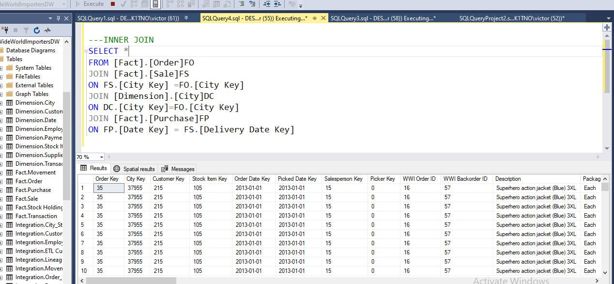

## RIGHT OUTER JOIN

Right outer join returns all rows from the right table with corresponding rows from the left table. If there is no matching row, NULLS are returned as value from left table.

SELECT *
 FROM [Dimension].[Customer]
 
 RIGHT OUTER JOIN [Fact].[Stock Holding]
 
 ON [Fact].[Stock Holding].[Lineage Key]=[Dimension].[Customer].[Lineage Key]

 ## LEFT OUTER JOIN

 Left Outer join returns all rows from the left table with corresponding rows from the right table. If there is no matching row, NULLS are returned as value from the second table.

 SELECT *
 
 FROM [Dimension].[Customer]
 
 LEFT OUTER JOIN [Fact].[Stock Holding]
 
 ON [Fact].[Stock Holding].[Lineage Key]=[Dimension].[Customer].[Lineage Key]
 

## GROUP BY STATEMENT

"GROUP BY" is another built-in function in SQL that allows you to group your data based on a specific field.

SELECT  SUM([Tax Amount]) 

FROM [Fact].[Transaction]

JOIN [Fact].[Purchase]

ON [Fact].[Purchase].[Date Key]=[Fact].[Transaction].[Date Key]

GROUP BY [Tax Amount]

## HAVING STATEMENT

HAVING" is used to filter the results of a "GROUP BY" statement. The "HAVING" statement comes after the "GROUP BY" statement.It is used to filter an aggregators 

SELECt Sum([OrderTotal])

FROM [dbo].[Orders]

JOIN [dbo].[Customers]

ON [Customers].CustomerID=[dbo].[Orders].CustomerID

GROUP BY OrderTotal

HAVING OrderTotal <500

## SUBQUERIES

Subqueries are a powerful tool that allow you to use the results of one query as part of another query. Subqueries are sometimes called "nested queries" because they're nested within another query.

SELECT CustomerID, CustomerName,Phone

FROM [dbo].[Customers]

WHERE CustomerID IN( SELECT CustomerID FROM [dbo].[Orders]

WHERE OrderTotal <500)

## CASE STATEMENT

The CASE statement is SQL's way of handling if/then logic. The CASE statement is followed by at least one pair of WHEN and THEN statements—SQL's equivalent of IF/THEN in Excel.

SELECT [City Key], Description,[Unit Price],Quantity, Profit,

 CASE
 
 WHEN Profit >= 800 THEN 'Better sales'
    
 WHEN Profit >=500 THEN 'Good sales'
   
	ELSE 'Fair sales'
   
	END
   
 FROM [Fact].[Sale]
 
JOIN [Dimension].[Customer]
 
 ON [Dimension].[Customer].[Customer Key]=[Fact].[Sale].[Customer Key]

  
 
